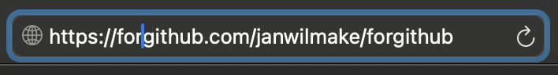
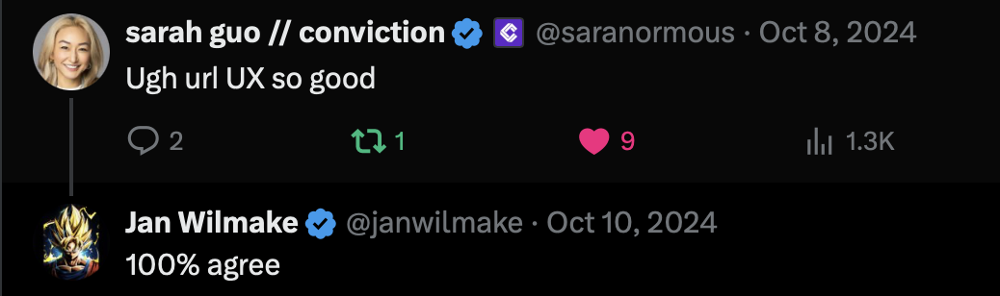

# GitHub Tools Powered By URL UX

Here's a list of tools that use the same URL structure as github enabling you to use it by just changing your url.

To navigate to your desired page more easily, go from any 'github.com/_' url to 'forgithub.com/_' and you'll get **quick links**! You can star your favorites, or after you remember them you can visit them directly.

## Editors

- bolt.new - [build apps with AI](https://bolt.new/github.com)
- stackblitz.com - [online IDE](https://stackblitz.com/github.com)
- pr.new - [run with codeflow](https://pr.new/github.com)
- github.dev - [VSCode in the browser](https://github.dev)

## LLM Context

- gitingest.com - [prompt-friendly codebase](https://gitingest.com)
- uithub.com - [prompt-friendly codebase](https://uithub.com)
- github.gg - [chat with codebase](https://github.gg)
- githuq.com - [chat with codebase](https://githuq.com)

## LLM Conversions

- gitpodcast.com - [codebase to podcast](https://gitpodcast.com)
- gitdiagram.com - [codebase to diagram](https://gitdiagram.com)

## APIs

- cache.forgithub.com - [cache of repo metadata](https://cache.forgithub.com)
- log.forgithub.com - [get last commits and contributor info](https://log.forgithub.com)
- zipobject - [Extract any zip over API](https://zipobject.com/github.com)
- config.zipobject.com - [Extract config files](https://config.zipobject.com/github.com)
- domain.zipobject.com - [Find domain for repo](https://domain.zipobject.com/github.com)

## Various

- githubtracker.com [track commits, issues, prs and more](https://githubtracker.com)

# Contributing

Please make a PR for any additional tools with the following requirements:

- follow the same structure in the README
- the tool must at least support the `/[owner]/[repo]/[page]/[brancg]/[...path]` url structure or a subset thereof
- the tool should have a freemium business model and not require sign-in at first
- bonus points if the tool exposes an `openapi.json` at its root

# Why?

URL UX makes tools highly accessible. Since a lot of what devs do evolves around repos, I figured that's a good one to focus on. 'Repo to Anything' is the dream!

# CHANGELOG

- 2025-01-12 - created the initial version of forgithub.com
- 2025-01-18 - improved layout
- 2025-01-27 - added ogimage and added columns and favicons to website. fixed ci/cd
